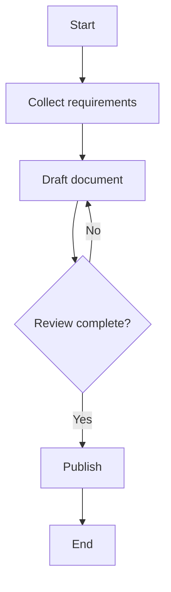
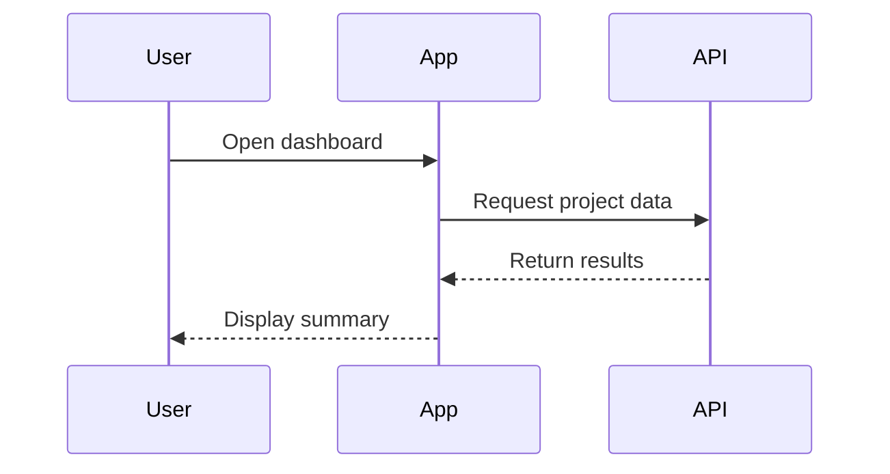
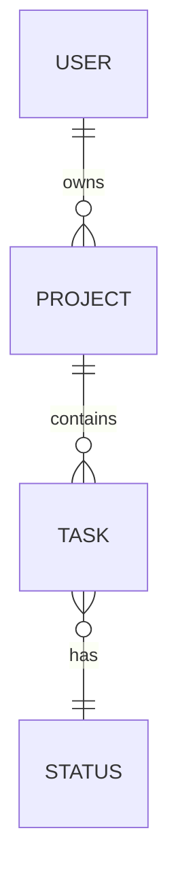
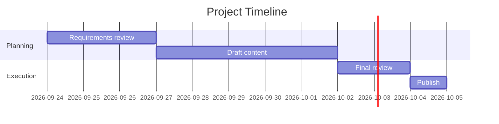
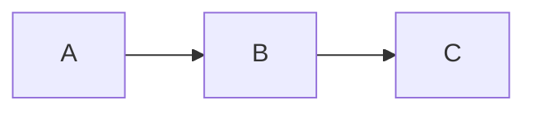
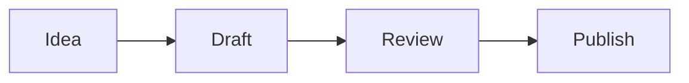

# Markdown Template

This file is a reusable template with examples of common entry types and text styles you can use in Markdown documents.

---

## 1. Basic heading structure

# Main Title
## Section Title
### Subsection Title
#### Smaller Detail

Use headings to organize content and make it easy to scan.

---

## 2. Plain text paragraph

This is a normal paragraph. It can be used for short explanations, summaries, or narrative notes.

Example:

This project is focused on improving team communication and maintaining consistent documentation across tasks, meetings, and follow-ups.

---

## 3. Bullet list entries

- First item
- Second item
- Third item

Example:

- Review the project requirements
- Confirm deadlines with stakeholders
- Prepare a summary of key decisions

---

## 4. Numbered list entries

1. Gather information
2. Draft the content
3. Review and revise
4. Share with the team

Example:

1. Open the project brief
2. Identify the main goals
3. Capture open questions
4. Update the final summary

---

## 5. Checklist entries

- [ ] Task one
- [ ] Task two
- [x] Task three completed

Example:

- [x] Create the initial draft
- [x] Review the structure
- [ ] Confirm final wording with stakeholders
- [ ] Publish the document

---

## 6. Example notes entry

### Daily Notes

**Date:** 2026-09-24  
**Topic:** Team planning  
**Status:** In progress

Summary:

The team reviewed priorities for the upcoming sprint and agreed to focus on documentation cleanup, issue triage, and onboarding improvements.

Key points:

- Documentation should be simplified for new team members
- Priority issues should be reviewed each Monday
- Follow-up tasks should be tracked in the project board

---

## 7. Example meeting entry

### Meeting Notes

**Meeting:** Weekly Team Sync  
**Date:** 2026-09-24  
**Attendees:** Alex, Priya, Jordan

Agenda:

1. Review progress from the last cycle
2. Discuss blockers and risks
3. Confirm next actions

Notes:

- The design review is still pending feedback from the client.
- The release checklist is nearly complete.
- A follow-up will be scheduled for next Tuesday.

Action items:

- [ ] Send updated mockups to the client
- [ ] Finalize the launch checklist
- [ ] Confirm testing schedule

---

## 8. Example journal or log entry

### Log Entry

**Entry Type:** Journal  
**Date:** 2026-09-24

Today I reviewed the current workflow and identified a few areas that could be improved. The process is mostly clear, but some handoff points are still unclear. I plan to document the expected steps and create a simpler checklist for future use.

Observations:

- The current process works, but it is easy to miss a step
- Some tasks depend on unclear ownership
- A short checklist would reduce confusion

Next step:

Create a clear task template and share it with the team for feedback.

---

## 9. Example quote or highlight block

> "Good documentation reduces confusion and makes every decision easier to follow later."

---

## 10. Table example

| Date | Item | Owner | Status |
| --- | --- | --- | --- |
| 2026-09-24 | Project kickoff | Alex | In progress |
| 2026-09-25 | Draft content review | Priya | Pending |
| 2026-09-27 | Publish summary | Jordan | Planned |

---

## 11. Code block example

```bash
npm install
npm run build
```

Example for notes or technical documentation:

```text
Task: Review documentation
Status: In progress
Owner: Team Lead
Deadline: 2026-09-30
```

---

## 12. Link example

[Project Documentation](https://example.com)

---

## 13. Sample full-page template

# Title

## Overview
Brief description of the purpose of this document.

## Objectives
- Objective one
- Objective two
- Objective three

## Details
Provide more detailed notes here.

## Action Items
- [ ] Task 1
- [ ] Task 2
- [ ] Task 3

## Notes
Add additional context, decisions, or observations here.

## Summary
End with a short recap of the most important information.

---

## 14. Quick copy-paste template

# [Project/Topic Name]

## Date
[YYYY-MM-DD]

## Summary
Write a short summary of the topic here.

## Key Points
- Point one
- Point two
- Point three

## Tasks
- [ ] Task one
- [ ] Task two
- [ ] Task three

## Notes
Add any supporting details, observations, or follow-up information here.

## Next Steps
1. Define the next action
2. Assign ownership
3. Set a timeline

---

## 15. Text formatting: bold, italic, strikethrough, inline code

### Bold
**This text is bold**

### Italic
*This text is italic*

### Bold + italic
***This text is bold and italic***

### Strikethrough
~~This text is crossed out~~

### Inline code
Use inline code for commands like `npm install` or variables like `version = 2`.

### Subscript and superscript
- Water is H~2~O.
- The formula is x^2^ + 2x + 1.

Example paragraph:

The project status is **on track**, but the release date is *subject to review*. We have completed the initial draft and will ~~remove outdated notes~~ before final publishing. The command to validate this is `npm run test`.

---

## 16. Paragraphs and line breaks

Markdown treats a blank line as a new paragraph.

This is paragraph one.

This is paragraph two.

To force a line break without starting a new paragraph, add two spaces at the end of the line before pressing Enter.

This is line one  
This is line two

Example:

The release checklist is nearly complete.  
The launch plan is ready for team review.

---

## 17. Nesting lists with content

- Project overview
  - Goal: improve the documentation process
  - Owner: Team lead
  - Deadline: 2026-10-01
    - Subtask: review current templates
    - Subtask: update the onboarding guide
- Team updates
  - Weekly sync scheduled for Wednesday
  - Notes are shared in the project channel

Example with mixed content:

1. Prepare content
   - Collect source notes
   - Confirm final wording
   - Review for clarity
2. Review process
   - Check checklist items
   - Confirm ownership
   - Update the timeline
3. Publish
   - Share the final document
   - Request feedback
   - Save the approved version

---

## 18. Images

### Remote image


### Local image


### Image with title


Example usage in a document:


> Tip: Keep image files in a folder such as `images/` and reference them with relative paths.

---

## 19. Mermaid diagrams

Mermaid lets you create flow charts, sequence diagrams, and more directly inside Markdown.

### Flow chart example



### Sequence diagram example



### Entity relationship diagram example



### Gantt chart example



---

## 20. How to visualize Markdown and Mermaid in VS Code

### Open Markdown preview
- Press `Ctrl+Shift+V` to open the Markdown preview.
- Press `Ctrl+K` then `V` to open preview to the side.

### Recommended extensions
- Markdown Preview Enhanced
- Markdown Preview Mermaid Support
- Mermaid Markdown Syntax Highlighting

### Common workflow
1. Create or edit a `.md` file.
2. Write Mermaid blocks using triple backticks and `mermaid`.
3. Open the preview pane.
4. Confirm that the diagram renders correctly.

Example:

````markdown

````

> If the diagram does not render, install a Mermaid-enabled preview extension or use the preview mode supported by your Markdown extension.

---

## 21. Final example template with mixed elements

# Project Summary

## Overview
This project focuses on improving internal documentation and task tracking. The goal is to make updates easier to review and simpler to maintain over time.

## Status
**Current status:** In progress  
*Priority:* High

## Key Points
- Documentation should be clear and easy to scan
- Team tasks should be tracked consistently
- Follow-up items need owners and dates

## Action Items
- [x] Draft the initial notes
- [ ] Review the checklist
- [ ] Share the final version with stakeholders

## Technical Notes
Use `git status` and `git add .` before creating a commit.

## Diagram


## Summary
The team has made good progress and is now focused on improving clarity, ownership, and follow-up tracking.

---

This section adds examples for inline formatting, sections on paragraphs and line breaks, nested lists, image usage, Mermaid diagrams, and VS Code preview instructions for rendering Markdown content visually.

